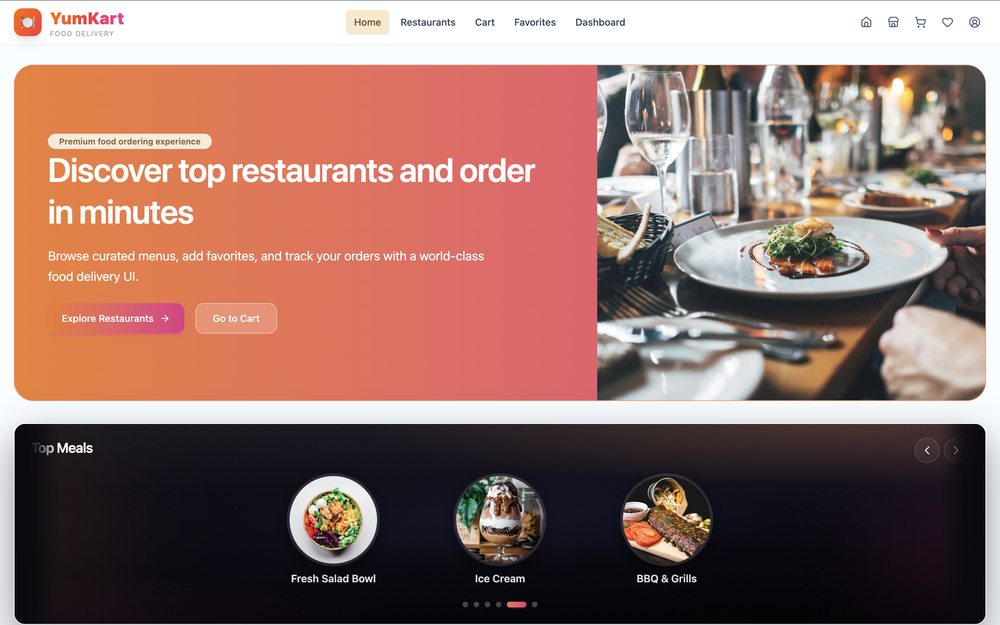
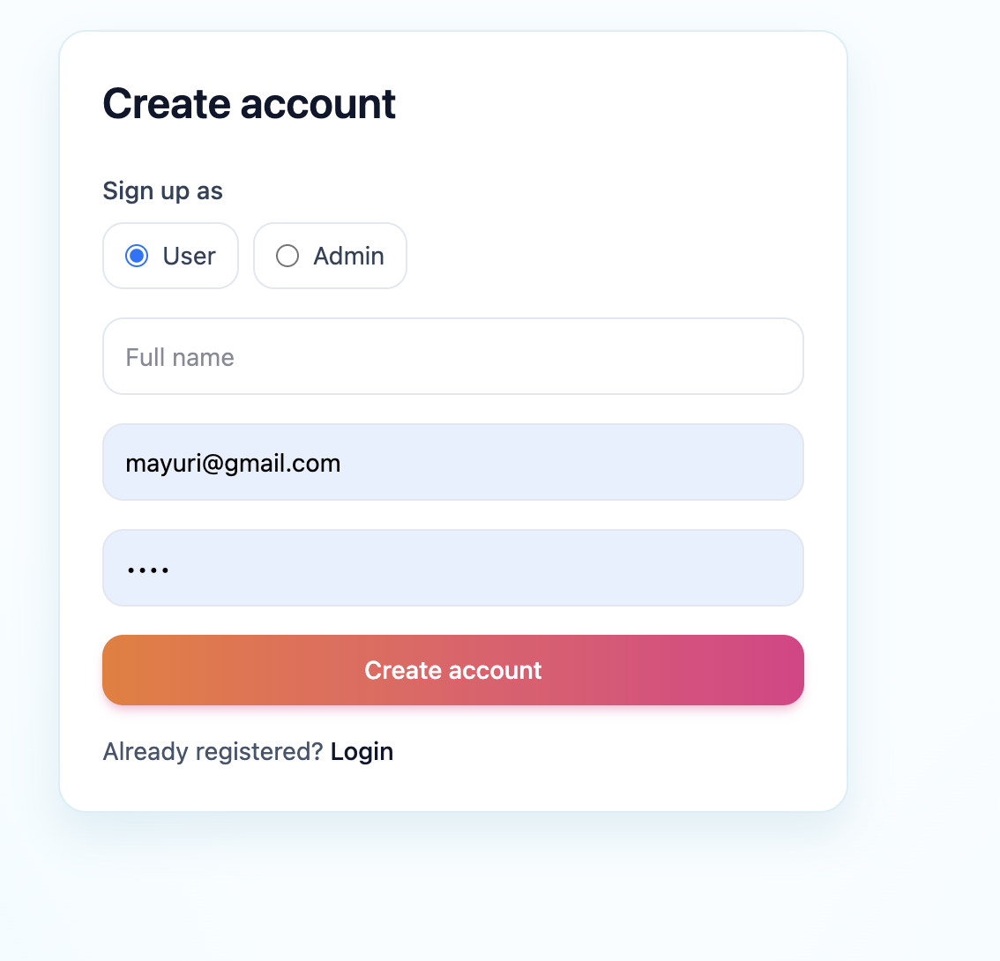
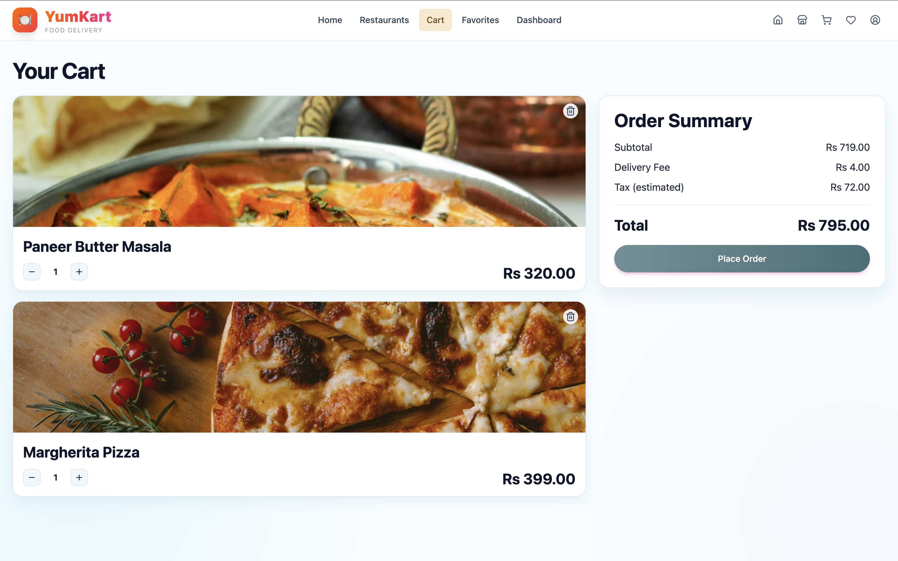
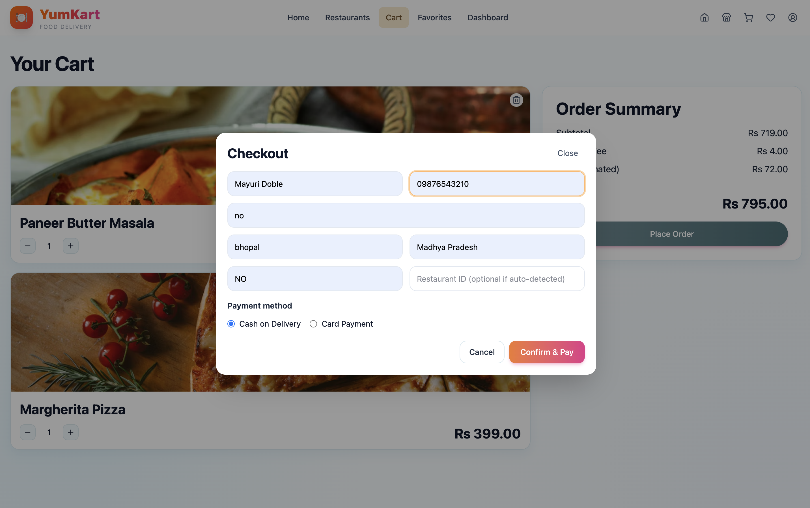
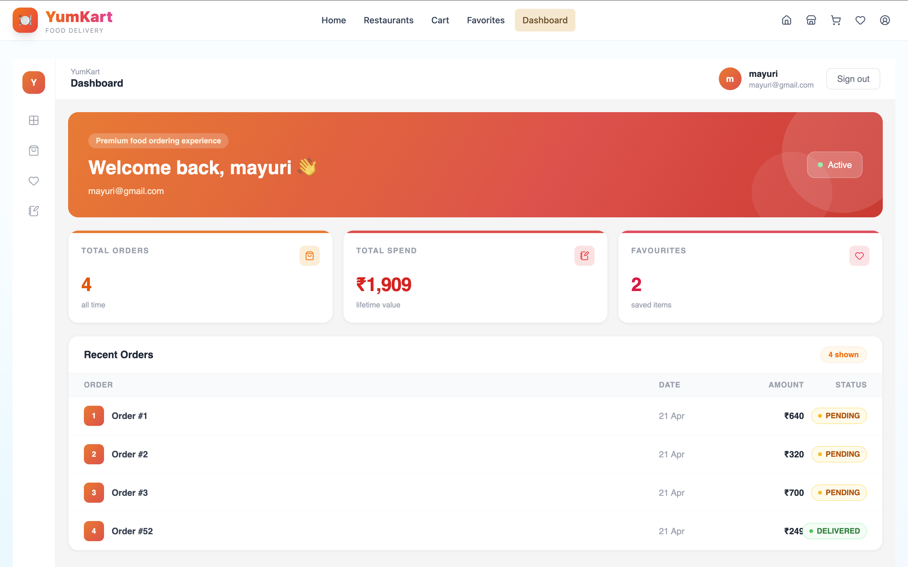

# YumKart

A modern online meal ordering & delivery experience with restaurant discovery, favorites, cart + checkout, and an admin dashboard for managing orders and dishes.
Built as a full-stack project with a React frontend and a Spring Boot API.

---

## Upload files to GitHub (Drag & Drop)

If you want to upload files directly from the browser:

1. Open your GitHub repo → go to the folder where you want to add files.
2. Click **Add file → Upload files**.
3. Drag & drop your files (or click **choose your files**).
4. Add a commit message → click **Commit changes**.

To edit an existing file in GitHub:

1. Open the file → click the ✏️ **Edit** button.
2. Make changes → scroll down → **Commit changes**.

Tip: For large changes, pushing via `git` is faster and safer.

---

## Features

Based on the current UI:

- **Home landing** with a hero section and quick navigation (Explore Restaurants / Go to Cart)
- **Top meals slider** for quick browsing
- **Restaurant discovery** with search + filters (veg/non-veg, cuisine, price, rating)
- **Restaurant cards** with open/closed status and menu navigation
- **Favorites** (save restaurants and view them later)
- **Cart** with quantity controls and a clean order summary
- **Checkout modal** with contact + address fields and payment method selection (e.g., Cash on Delivery / Card)
- **User dashboard** with order metrics and recent order tracking
- **Role-based signup** (User vs Admin)
- **Admin tools**: create restaurant on admin signup, manage orders, and add new dishes

---

## Tech Stack

### Frontend (`food-ordering-frontend`)

- **React 19** + **Vite 8**
- **React Router DOM 7**
- **Redux Toolkit** + **React Redux**
- **React Hook Form** + **Zod** (+ `@hookform/resolvers`)
- **Axios**
- **Tailwind CSS v4** (via `@tailwindcss/vite`) + CSS
- **lucide-react**, **clsx**, **tailwind-merge**
- **ESLint 9** + **Prettier**

### Backend (`Online-Food-Ordering`)

- **Java 17** + **Maven Wrapper (mvnw)**
- **Spring Boot 4.0.5** (WebMVC)
- **Spring Security** + **JWT** (jjwt)
- **Spring Data JPA** + **Hibernate**
- **MySQL** (mysql-connector-j)
- **Lombok**
- Test starters for JPA/Security/WebMVC

---

## Screenshots

Place your screenshots in the root `screenshots/` folder using these exact filenames:

- `home.png`
- `signup.png`
- `restaurants.png`
- `cart.png`
- `checkout.png`
- `dashboard.png`

Then GitHub will render them here:








---

## Installation & Setup

### Prerequisites

- Node.js (LTS recommended)
- Java 17
- MySQL running locally

### 1) Backend (Spring Boot API)

```bash
cd Online-Food-Ordering

# Set DB credentials (macOS/Linux)
export DB_URL="jdbc:mysql://localhost:3306/zosh_food_yt"
export DB_USERNAME="root"
export DB_PASSWORD="<your_password>"

./mvnw spring-boot:run
```

API runs on: `http://localhost:5454`

### 2) Frontend (React)

```bash
cd food-ordering-frontend
npm install

# Optional: point frontend to API
# macOS/Linux
export VITE_API_BASE_URL="http://localhost:5454"

npm run dev
```

Web app runs on: `http://localhost:3000`

---

## Folder Structure

```text
Food-Ordering/
	food-ordering-frontend/   # React + Vite app
	Online-Food-Ordering/     # Spring Boot API
	README.md
```

---

## API (Quick Reference)

Base URL (local): `http://localhost:5454`

### Auth

- `POST /auth/signup` — user signup
- `POST /auth/signup/admin` — admin/restaurant-owner signup (includes restaurant details)
- `POST /auth/signin` — login (returns JWT)

### User

- `GET /api/users/profile` — current user profile (JWT required)

### Restaurants

- `GET /api/restaurants` — list restaurants
- `GET /api/restaurants/{id}` — restaurant details
- `GET /api/restaurants/search?keyword=...` — search
- `PUT /api/restaurants/{id}/add-favourites` — toggle favorite (JWT required)

### Admin

- `GET /api/admin/restaurants/user` — restaurant for logged-in admin
- `GET /api/admin/order/restaurant/{restaurantId}` — restaurant orders
- `POST /api/admin/food` — add a dish

---

## Notes

- Never commit real passwords or secrets. Use environment variables for DB credentials and API keys.

